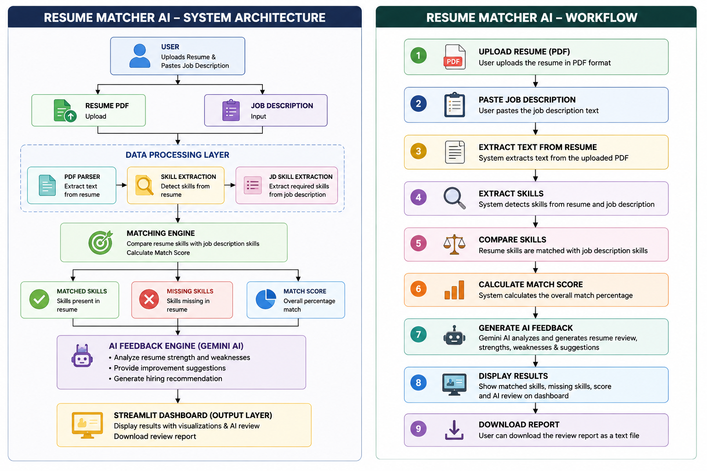

# 📄 ResumeMatcher AI

<p align="center">


</p>

<p align="center">

### 🚀 Live Demo

**https://resumematcherai-w2p5bvrgd8zmge7qvvvuma.streamlit.app**

</p>

---

# 📌 Project Overview

ResumeMatcher AI is an AI-powered Resume Screening and ATS Matching System developed using **Python**, **Streamlit**, **Natural Language Processing (NLP)**, and **Google Gemini AI**.

The application automatically extracts resume content, identifies technical skills, compares them with job requirements, calculates an ATS match score, identifies missing skills, and generates AI-powered resume feedback with hiring recommendations.

---

# ✨ Features

- 📄 Upload Resume PDF
- 🔍 Automatic Resume Text Extraction
- 🧠 Resume Skill Detection
- 📋 Job Description Skill Extraction
- 📊 ATS Match Score Calculation
- ✅ Matched Skills Identification
- ❌ Missing Skills Detection
- 🤖 AI Resume Review using Gemini AI
- 💪 Resume Strength Analysis
- ⚠️ Resume Weakness Analysis
- 📈 Skill Gap Identification
- 👨‍💼 Hiring Recommendation
- 📥 Download Resume Review Report
- 📊 Interactive Dashboard with Gauge Chart

---

# 🏗️ System Architecture & Workflow

<p align="center">

</p>

The diagram above illustrates the complete ResumeMatcher AI pipeline—from uploading a resume and job description, extracting text and skills, calculating the ATS match score, generating AI-powered feedback using Gemini AI, and presenting the results through an interactive Streamlit dashboard.

---

# 🛠️ Technology Stack

| Technology | Purpose |
|------------|---------|
| Python | Backend Development |
| Streamlit | Interactive Web Application |
| PyPDF | Resume PDF Parsing |
| NLP | Skill Extraction & Matching |
| Google Gemini AI | AI Resume Feedback |
| Plotly | Match Score Dashboard |

---

# 📂 Project Structure

```text
ResumeMatcherAI/

│── assets/
│     └── ai_resume_diagrams.png
│
│── modules/
│     ├── gemini_ai.py
│     ├── matcher.py
│     └── resume_parser.py
│
│── app.py
│── requirements.txt
│── README.md
│── test_matcher.py
```

---

# ⚙️ Installation

## Clone Repository

```bash
git clone https://github.com/mohammadthoufeeq12190-design/ResumeMatcherAI.git

cd ResumeMatcherAI
```

## Create Virtual Environment

```bash
python -m venv venv
```

### Windows

```bash
venv\Scripts\activate
```

### Linux / macOS

```bash
source venv/bin/activate
```

## Install Dependencies

```bash
pip install -r requirements.txt
```

## Run the Application

```bash
streamlit run app.py
```

---

# 🔄 Application Workflow

1. Upload Resume PDF
2. Extract Resume Text
3. Detect Resume Skills
4. Read Job Description
5. Compare Skills
6. Calculate ATS Match Score
7. Generate AI Feedback
8. Display Dashboard
9. Download Resume Review Report

---

# 📊 Sample Output

### Resume Match Score

```text
66.67%
```

### Matched Skills

```text
Python
SQL
Machine Learning
Git
```

### Missing Skills

```text
AWS
Docker
```

### AI Recommendation

```text
Suitable for Entry-Level AI Engineer Roles
```

---

# 💼 Skills Demonstrated

- Python Development
- Artificial Intelligence
- Natural Language Processing (NLP)
- ATS Resume Matching
- Resume Analytics
- Prompt Engineering
- Streamlit Application Development
- Data Processing
- Dashboard Development
- Software Engineering Best Practices

---

# 🚀 Future Enhancements

- Multi-Resume Comparison
- Resume Ranking System
- ATS Keyword Optimization
- Recruiter Dashboard
- Authentication System
- PDF Report Generation
- Cloud Database Integration
- REST API Support
- Docker Deployment
- Multi-Language Resume Analysis

---

# 👨‍💻 Author

## Syed Thoufeeq

**Aspiring AI Engineer | Machine Learning Enthusiast | Generative AI Developer**

**GitHub:**  
https://github.com/mohammadthoufeeq12190-design

---

# ⭐ Support

If you found this project useful, consider giving it a ⭐ on GitHub.
